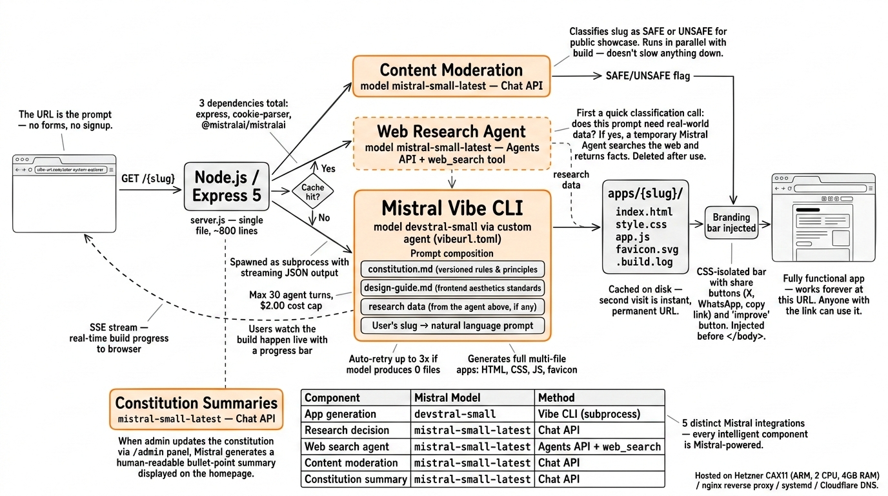

# vibe-url

**Type a description in the URL. Get a working app.**

[vibe-url.com](https://vibe-url.com) turns URLs into fully functional single-page web apps. No signup, no forms, no prompts to fill out. You just type what you want directly into the address bar -- like `vibe-url.com/pomodoro-timer-with-ambient-sounds` -- and a few seconds later you have a live, shareable app.

Built for the [Mistral Worldwide Hackathon](https://hackiterate.com/mistral-worldwide-hackathons) (Feb 28 - Mar 1, 2026).

---

## What the user experiences

1. **Land on the homepage.** A dark, polished interface with a single input styled like a browser address bar. A ticker scrolls through recently-created apps. Three showcase cards preview real examples -- hover to see live iframes of the actual apps.

2. **Type anything after the slash.** `vibe-url.com/budget-tracker-for-freelancers`, `vibe-url.com/solar-system-explorer-with-orbital-mechanics`, `vibe-url.com/recipe-converter-metric-to-imperial` -- whatever. Spaces become dashes as you type.

3. **Watch it build.** A loading screen connects over Server-Sent Events (SSE). A progress bar tracks the estimated build time (calibrated from averages of past builds). A live terminal shows what the Vibe agent is doing: researching data, writing files, setting up the app.

4. **Use your app.** When the build finishes, the page reloads and you're looking at a fully functional web app -- complete with its own custom favicon. A small branding bar in the corner lets you share it on X or WhatsApp, copy the link, or hit "improve" to go back and try a different slug.

5. **Come back anytime.** Every app lives permanently at its URL. Second visit is instant -- it's cached on disk. Anyone with the link can use it.

The whole thing works without accounts, API keys, or configuration of any kind. The URL *is* the prompt.

---

## How it uses Mistral



vibe-url is built on four distinct Mistral integrations that work together in a pipeline:

### 1. Mistral Vibe CLI -- App Generation (core)

The heart of the project. When a user requests an app, the server spawns [Mistral Vibe](https://mistral.ai/products/vibe) as a subprocess using a custom agent (`vibeurl`) running the `devstral-small` model. The agent receives a carefully constructed prompt that combines:

- A **constitution** -- a versioned set of rules and principles that govern every generated app (role definition, leadership principles, technical constraints, content safety guidelines, favicon generation)
- A **design guide** -- opinionated frontend design standards that push for bold, distinctive UIs (mandates unique Google Fonts, custom color palettes, CSS animations; explicitly bans generic AI aesthetics)
- **Research data** -- real-world facts gathered by the web search agent (see below), if the prompt needs them
- The **user's request** -- derived from the slug they typed

The CLI runs with `--output streaming` so the server can relay progress to the browser in real time via SSE. It's capped at 30 agent turns and $2.00 per generation. If the model produces zero files on the first attempt (a known edge case where it sometimes "thinks" instead of coding), the server automatically retries up to 3 times.

### 2. Mistral Agents API + Web Search -- Pre-Research

Before the build starts, the server makes a quick `mistral-small-latest` call to decide: "Does this prompt need real-world data?" A request for `pomodoro-timer` doesn't, but `current-weather-in-tokyo` does.

If the answer is yes, the server creates a temporary Mistral Agent via the REST API with the `web_search` tool enabled. It asks the agent to find and return relevant facts, then injects the results into the build prompt under a `## Research data` section. The temporary agent is deleted after use.

This means a request like `vibe-url.com/upcoming-spacex-launches` actually gets live launch data baked into the app, not hallucinated dates.

### 3. Mistral Chat API -- Content Moderation

Every slug is checked in parallel with the build (so it doesn't slow anything down). A `mistral-small-latest` call with temperature 0 evaluates whether the app title is appropriate for the public showcase carousel. The result (SAFE/UNSAFE) determines whether the app appears in the homepage ticker.

Harmful requests still build -- but the constitution instructs the Vibe agent to pivot them into a "Safety Dashboard": a witty, educational page that explains why the original request was problematic. The app gets generated either way, but it won't show up in the public feed.

### 4. Mistral Chat API -- Constitution Summaries

When an admin updates the constitution through the admin panel, a `mistral-small-latest` call generates a human-friendly 5-8 bullet point summary. This summary is displayed on the homepage in a modal ("read our constitution") so users can understand the principles behind the platform without reading the full document.

### Summary of Mistral models used

| Integration | Model | Method |
|---|---|---|
| App generation | `devstral-small` (via Vibe CLI) | CLI subprocess |
| Research decision | `mistral-small-latest` | SDK `chat.complete` |
| Web search agent | `mistral-small-latest` | REST API (Agents) |
| Content moderation | `mistral-small-latest` | SDK `chat.complete` |
| Constitution summary | `mistral-small-latest` | SDK `chat.complete` |

---

## Technical architecture

```
                    User types: vibe-url.com/budget-tracker
                                    |
                              +-----v------+
                              |   nginx    |  (SSL termination, SSE-friendly proxy)
                              +-----+------+
                                    |
                              +-----v------+
                              | Express 5  |  (server.js, ~800 lines)
                              +-----+------+
                                    |
               +--------------------+--------------------+
               |                    |                    |
        +------v-------+    +------v-------+    +-------v------+
        |  Moderation  |    |  Research    |    |   Vibe CLI   |
        |  (parallel)  |    |  (if needed) |    |   (build)    |
        +--------------+    +--------------+    +--------------+
        | mistral-small|    | Agents API   |    | devstral-    |
        | chat.complete|    | + web_search |    | small agent  |
        | -> SAFE/UNSAFE    | -> facts     |    | -> app files |
        +--------------+    +--------------+    +------+-------+
                                                       |
                                                +------v-------+
                                                | apps/{slug}/ |
                                                | index.html   |
                                                | *.css, *.js  |
                                                +--------------+
                                                       |
                                            +----------v-----------+
                                            | Branding bar injected|
                                            | (share, improve)     |
                                            +----------------------+
```

### Request lifecycle

1. **Slug sanitization** -- lowercased, stripped to `[a-z0-9-_]`, capped at 2000 chars. Long slugs get truncated directory names with a SHA-256 hash suffix for uniqueness.

2. **Cache check** -- if `apps/{slug}/index.html` exists, serve it immediately. Visit counter incremented.

3. **Concurrent build deduplication** -- if a build is already in progress for this slug, the new client attaches to the existing SSE stream and gets a replay of all log messages so far.

4. **Moderation** starts in parallel (non-blocking).

5. **Pre-research** -- quick classification call, then web search agent if needed. Research duration is tracked separately for progress bar calibration.

6. **Build** -- Vibe CLI spawned with the full prompt. Stdout is parsed line-by-line for streaming JSON events (tool calls, file writes, agent turns). These are relayed to all connected clients via SSE.

7. **Progress estimation** -- the loading page uses an exponential curve (`90 * (1 - e^(-2.5 * elapsed/estimate))`) capped at 88% so it never looks stuck near 100%. Estimates are rolling averages of past builds.

8. **Auto-retry** -- if the model produces 0 files in 2 or fewer turns (a "blank" generation), the server retries up to 3 times.

9. **Serving** -- generated files served statically. Dotfiles (`.build.log`, `.prompt.txt`) blocked from public access. Directory traversal prevented.

10. **Branding bar** -- injected before the last `</body>` tag. CSS-isolated with `all: initial` to avoid conflicts with generated app styles. Includes share (X, WhatsApp, copy URL) and an "improve" button that pre-fills the homepage input.

### Admin panel

Accessible at `/admin` with session-based auth. Two sections:

- **Constitution editor** -- full-text editor with Cmd+S shortcut, version history dropdown, and a deploy confirmation flow. Every save archives the previous version with a timestamp, bumps the version number, and regenerates the public summary. Constitution versions are tracked per-app so you can see which apps were built under which rules.

- **Project manager** -- table of all generated apps with visit counts, constitution versions (color-coded: green = current, orange = outdated), and delete capability. Auto-refreshes every 30 seconds.

---

## Tech stack

- **Runtime:** Node.js + Express 5
- **App generation:** [Mistral Vibe CLI](https://mistral.ai/products/vibe) with custom agent config
- **AI models:** `devstral-small` (generation), `mistral-small-latest` (research, moderation, summaries)
- **AI SDK:** `@mistralai/mistralai` v1.14.1 + direct REST calls to Agents API
- **Real-time:** Server-Sent Events (SSE) with multi-client support and log replay
- **Hosting:** Hetzner CAX11 (ARM, 2 CPU, 4GB RAM), nginx reverse proxy, systemd
- **Domain:** Cloudflare Registrar
- **Dependencies:** 3 total (`express`, `cookie-parser`, `@mistralai/mistralai`)

---

## Running locally

```bash
git clone https://github.com/YOUR_USERNAME/vibe-url.git
cd vibe-url
npm install
```

You need:
- [Mistral Vibe CLI](https://mistral.ai/products/vibe) installed (`vibe` binary on PATH)
- A Mistral API key in `~/.vibe/.env`
- The custom agent config at `~/.vibe/agents/vibeurl.toml`

```bash
node server.js
# Server starts on http://localhost:3000
```

Navigate to `localhost:3000/anything-you-want` and it will actually build the app locally.

Note: `constitution.md`, `data.json`, and the `apps/` directory are created at runtime and are not checked into git. The production constitution lives on the server and is managed through the admin panel.

---

## Team

- **Pablo** -- development, architecture, deployment
- **Francesca** -- concept, design direction
- Built during the Mistral Worldwide Hackathon, Feb 28 - Mar 1, 2026
